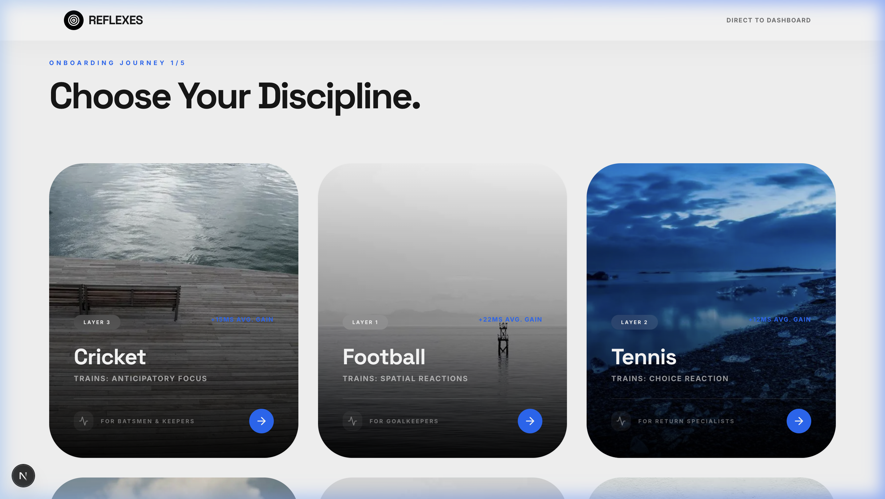
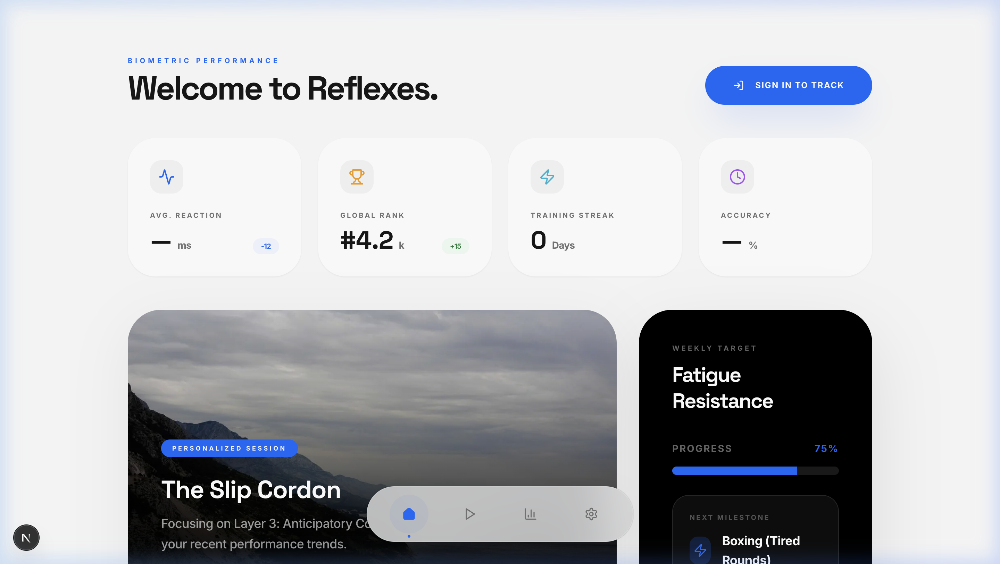

<p align="center">
  
  
  
  
</p>

# Reflexes

Professional cognitive training for athletes. Sport-specific drills that measurably sharpen reaction time, peripheral vision, and decision speed — delivered through your phone's camera.

---

<p align="center">
  
</p>

<p align="center">
  
</p>

---

## How it works

Choose your sport. Calibrate your baseline. Train.

The system generates adaptive AR drills tailored to your discipline — each session pushes your neural response closer to professional thresholds.

---

## Disciplines

| Sport | Trains | Avg. Gain |
|:------|:-------|:----------|
| Cricket | Anticipatory focus | +15 ms |
| Football | Spatial reactions | +22 ms |
| Tennis | Choice reaction | +12 ms |
| Basketball | Peripheral vision | +18 ms |
| Boxing | Fatigue resistance | +30 ms |
| General | Neural baseline | +25 ms |

---

## Features

**AR Drill Interface** — Real-time augmented reality targets using your device camera. No hardware required.

**Adaptive Difficulty** — AI-generated drill sequences that evolve with your performance. Powered by Genkit + Gemini.

**Structured Progression** — Four neural layers, from foundational reflexes to sport-specific anticipation patterns.

**Performance Dashboard** — Track streaks, reaction times, and improvement trends over time.

**90-Second Start** — No account required. Pick a sport. Start training.

---

## Stack

| | |
|:--|:--|
| Framework | Next.js 15 · App Router · Turbopack |
| AI | Google Genkit · Gemini |
| Backend | Firebase |
| Components | Radix UI · shadcn/ui |
| Styling | Tailwind CSS |
| Language | TypeScript |

---

## Setup

```bash
git clone https://github.com/Kumar-Gaurav-1/reflexes.git
cd reflexes
npm install
cp .env.example .env    # Add your Gemini API key
npm run dev             # → http://localhost:9002
```

### Environment

| Variable | Purpose |
|:---------|:--------|
| `GEMINI_API_KEY` | Powers adaptive drill generation and cognitive challenges |

Get a key → [aistudio.google.com/apikey](https://aistudio.google.com/apikey)

---

## Architecture

```
src/
├── ai/                    Genkit flows — adaptive drills, cognitive challenges
├── app/
│   ├── dashboard/         Training dashboard
│   ├── drills/            Active sessions
│   ├── onboarding/        Sport selection → baseline calibration → tutorial
│   ├── setup/             Vision lab configuration
│   └── stats/             Performance analytics
├── components/
│   └── ar-drill-view      Core AR training interface
├── firebase/              Auth, Firestore hooks, error handling
└── lib/                   Utilities, placeholder data
```

---

## Limitations

- AR drills require camera access and a modern mobile browser
- Best experienced on smartphones; desktop is functional but secondary
- Cross-device sync requires Firebase project configuration

---

<p align="center">
  <sub>MIT License</sub>
</p>
